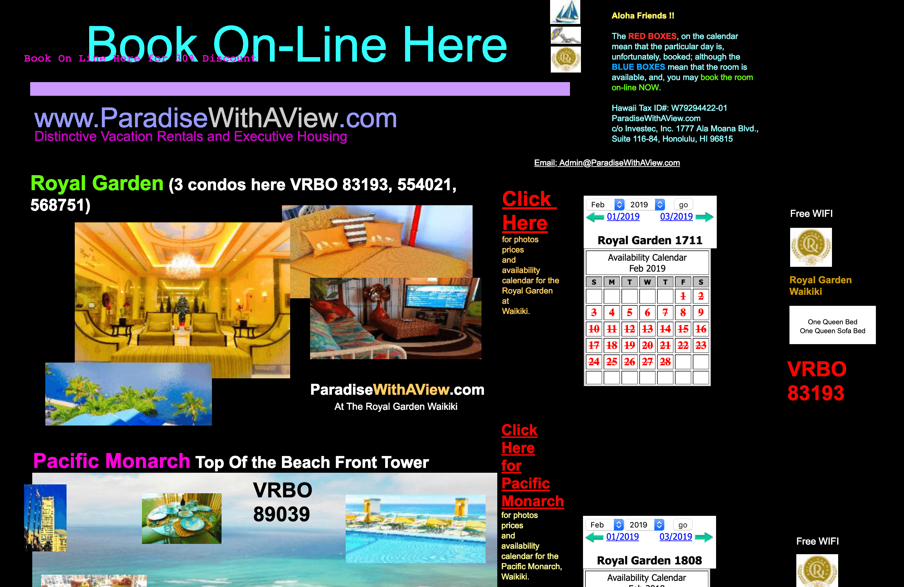
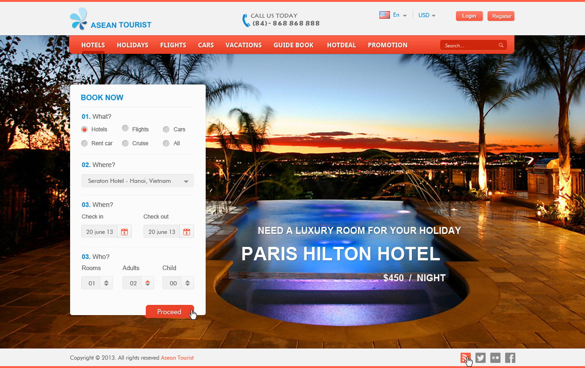

## The Answer is Simple

Yes. It's worth it. What am I referring to you ask? Well if you had somehow missed the three associated labels with this essay, I'm referring to UI Frameworks! Take a look at the image above this body of the text. Try not to look for too long, I don't want you to strain your eyes too much. Now I assume that you've done your fair share of browsing the Internet. You probably have a favorite browser too. Perchance you even frequent certain websites. Maybe you're constantly kept up with recent events because you're always reading news from one of the many news sites out there. Perhaps you essentially live on Youtube, watching various kinds of videos to entertain yourself. The point is you've likely visited at least one webpage. Now imagine if those websites looked like the image above. Are you still going to those webpages if alternatives exist?

## How to OWN the Internet with a Simple Footprint

Obviously "Owning" the Internet is very hyperbolic and unrealistic. There's no real owner of the Internet. But you can leave a footprint with a simple webpage. But why stop at some random, one-and-done, barebones webpage that you made just to learn HTML and CSS? Make your footprint very defined and clear. Maybe your footprint has multiple viewers a day. Pictures of your footprint get shared with even more people. Perhaps you could even monetize your footprint. Well, the first step, pun intended, would be to make your footprint aesthetically pleasing. How do we do that? Two words. UI Frameworks.

## What NOT to do & What TO do
Your website - your footprint if you hadn't gotten the analogy yet - should NOT look like the image at the top of this page. A much better example of a website with a similar intention, to book a hotel room(s) online, can be found right above this paragraph. From here on I'll be referring to the image at the very top of the page as a "bad example" and the above image as a "good example". Now unlike the bad example, the good example has a very clean overlay, each button tells you clearly where you are or where you could go once you click on one of the items along with the top menu, it even provides functionality to change languages and currency. That's exactly what you SHOULD do. Make your user understand where they are on the webpage, where they could go, and why they may want to go somewhere else, understand that not everyone uses USD and understands English. It also looks very clean, centered, and is much easier on the eyes, unlike my room. What you SHOULDN'T do is have blocks in your webpage that effectively do the same thing, have images overlapping one another (unless this is the intended effect but at that point just have them cycle through the images), not have almost every string of text using a different font color, and certainly not have your text overlap among other sins the bad example has committed. Very quickly consider this, if both webpages had you book the same hotel (ignore that having two webpages for the same hotel don't make sense) which one would you visit to book your well-earned vacation? If you answered anything but a good example then you're either in denial or have very odd tastes.

## Do you Really Have To?

Now you don't have to learn UI Frameworks to be a prospering web developer. You can make a perfectly fine [webpage using nothing but HTML and CSS](https://medium.com/@william.b/i-built-a-raw-html-website-with-no-frameworks-heres-what-i-learned-407249be2137). It's possible to do so. But there's a reason virtually every webpage on the internet now uses some kind of UI Framework. It's very hard to make an HTML-only webpage to make it aesthetically pleasing and practical as well. The main problem would be making it look very pretty. Although the bad example was very obviously done to show what not to do, no functioning hotel would ever have a webpage for their hotel that looked as atrocious as the bad example does, it's still a pain in the neck to do the proper formatting for a webpage using nothing but HTML such that it looks similar to a good example. Ultimately it's difficult to do, allows for mistakes to be more common as they're easier to make, and those mistakes could have been avoided if you had used some sort of UI Framework like Semantic or Bootstrap. Unless you really enjoy the challenge, there's no need to make things so hard on yourself. But who am I to say, go ahead and leave your footprint on the internet!