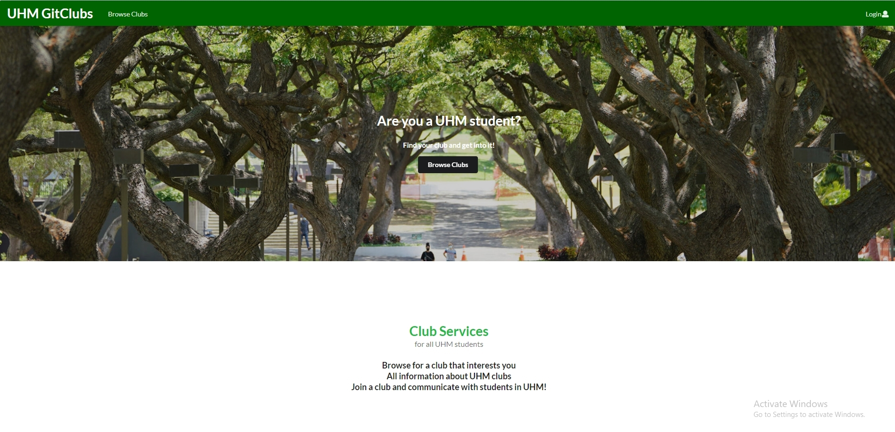

UHM GitClubs is an application for UH Manoa students that provides a centralized directory for Registered Independent Organizations at UH Manoa. Anyone can visit the website to just browse the directory of clubs. The directory includes a description of the club, a link to their website, and contact information. Users can log in and join a club from the directory.

Current Features Include:

1) Join a club, and have a list of clubs that you are in
2) Admins and club moderators can edit a club
3) Admins can create or delete a club

My contributions towards this project include fixing certain bugs (things not showing up), adding proper functionality to some pages, and creating mockup pages for us to add functionality to later on in the life cycle of the project. We had a few issues with this project that included certain pages not showing up when logged in as a user with a particular role, ie; Club Moderator. In addition, we had to create mockups, essentially a skeleton for the web app that we would build off of in the future to implement each page properly such that they all function as intended. Adding functionality to certain pages is exactly as it states, I had a few pages that I had to ensure work as intended such as the "manage clubs (moderator) page", the "edit club page", as well as making the button reactions work as intended. My responsibilities and contributions are not wholly unique as all of my group mates had relatively similar contributions, but for different pages.

From this project, I learned a lot about project management, web application development, and software engineering in general. When it comes to real projects, this was my first group software engineering project. As such properly managing everyone in the group and ensuring that we make timely progress was a must. As such I learned about and implemented "Issue Driven Project Management" IDPM for short. How IDPM works are essentially over 1-2 weeks everyone in the group works together to create issues/micro-goals for everyone to work to resolve to take baby steps towards finishing the project. Along the way, my understanding of software engineering and web app development grew simply as a consequence of actually doing web app development. I grew more familiar with the "Semantic UI React" and "Meteor" frameworks, as well as the Javascript language.

Source: <a href="https://github.com/uhm-gitclubs/uhm-gitclubs"><i class="large github icon"></i>uhm-gitclubs/uhm-gitclubs</a>